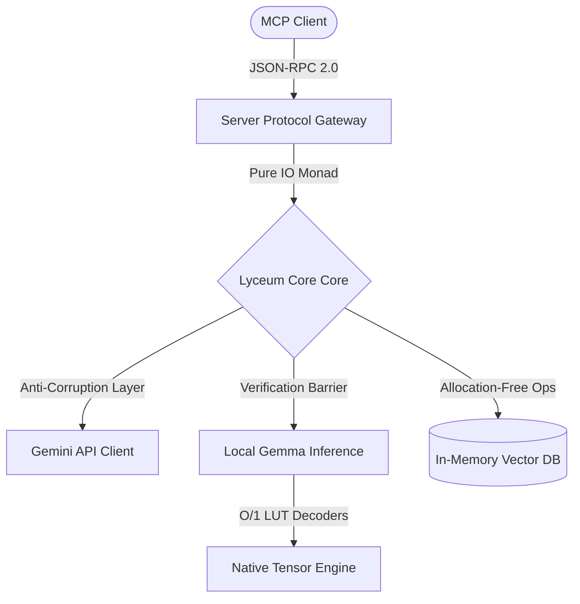

# Lyceum Architecture & System Design Specification

This document defines the mathematical, logical, and structural blueprints for the `Lyceum` project, focusing on Whole Optimization (Global Optimization), boundary minimization (Anti-Corruption Layer), and verification guarantees.

---

## 1. System Goals and Constraint Modeling (Top-Down Design)

Lyceum is designed as a provably secure LLM Control Plane and Retrieval-Augmented Generation (RAG) engine.



### 1.1. Core Domain Goal
To bound the stochastic nature of Large Language Models within mathematical invariants enforced by types and state machine traces (`Nomos`), preventing unverified execution paths or data leaks at the physical boundaries.

### 1.2. Identifying System Constraints (Bottlenecks)
1. **CPU/Execution Throttling**: Double-nested loops during tensor matrix multiplication (`matmul`) and quantized element decoding.
2. **Heap Memory Allocation Spikes**: O(N) array copy operations during cosine similarity scanning or sequential float conversions.
3. **Boundary latency**: Network state instability during Gemini API streaming.

---

## 2. Boundary Minimization (Interface Core & Defenses)

To safeguard the internal logic from external mutations and API instabilities, the system boundary is consolidated into a single Anti-Corruption Layer.

### 2.1. Pure IO Boundary Enforcement
The `LlmBackend` type-class serves as the primary system gate:
```lean
class LlmBackend (α : Type) where
  streamChatCompletion : (self : α) → (history : List Message) → (options : Option LlmRequestOptions) → IO (Except AppError (List Message))
```
- **Monad Isolation**: This gateway returns a pure Lean 4 `IO` monad instead of parameterizing over arbitrary `m`. This decouples compiler validation from upper orchestrators (e.g., `Pakila`), establishing a strict execution partition.

### 2.2. Anti-Corruption Layer (Gemini Client)
External calls to the Gemini API are isolated inside `Lyceum.Inference.Gemini`. 
- **Strict Parsing Boundaries**: Instead of feeding raw JSON across systems, chunks are instantly mapped to type-safe internal domain models (`GeminiPart` $\to$ `MessagePart`).
- **Defensive Error Translations**: Process exit failures (e.g., `curl` exiting with non-zero codes due to DNS/network timeouts) are caught at the interface and mapped to explicit domain errors (`AppError.NetworkError`) instead of parsing failures.

---

## 3. Quantization Core and Mathematics (No Stub Policy)

In accordance with the "No Stub Policy", all hardware emulation layers, FP16 scaling, and low-bit matrix operations are physically implemented with direct mathematics.

### 3.1. Physical FP16 Decoding
The system parses Half-Precision Float (FP16) variables to Float (FP32) using bitwise mantissa, exponent, and sign-bias recovery:
$$\text{Norm Value} = (-1)^{\text{sign}} \times 2^{\text{exp} - 15} \times \left(1 + \frac{\text{frac}}{1024}\right)$$

### 3.2. Static Lookup Table (LUT) Decoders
To bypass runtime parsing loops and complex floating-point calculations, the system loads static tables at initialization:
- **FP8 (E4M3)**: Maps $256$ bit states directly to Float.
- **FP4 (E2M1)**: Maps $16$ states, decoding packed high/low nibbles per byte.
- **1-bit (Binary Weight)**: Maps $256$ byte combinations directly to their $8$-element float projections ($0 \to -1.0$, $1 \to 1.0$), achieving a constant $\mathcal{O}(1)$ runtime lookup complexity.

### 3.3. Allocation-Free Operations ($\mathcal{O}(1)$ Allocation)
To prevent heap-thrashing and garbage collector spikes during tensor calculation, all loops are stripped of recursive dynamic array growth:
- **Matrix Multiplication**: `matmulNative` pre-allocates the exact memory space using `Array.ofFn` instead of executing repeated `push` or `set!` copying.
- **Quantization Decoding**: Employs `Array.ofFn` to project the decoded values into flat memory in a single allocation pass.
- **Cosine Similarity**: VectorDB calculates dot product and norms concurrently in a single loop over plain `Array Float`, avoiding the conversion to `FloatArray` entirely:
  $$\text{Similarity} = \frac{\sum (A_i \cdot B_i)}{\sqrt{\sum A_i^2} \cdot \sqrt{\sum B_i^2}}$$

---

## 4. Verification Guarantees (Nomos Contracts & E2E Tests)

### 4.1. Nomos Trace Conformance
The state transition rules of the MCP server are verified against abstract traces using the Nomos verification engine:
```lean
def checkNormalTrace : Bool := IsConsistentTrace serverAgent normalTrace
```
This mathematically guarantees that the server cannot violate state-invariants (such as serving request parameters prior to receiving the initial handshake packet).

### 4.2. Physical Integration Tests
The project features a dedicated executable test runner verifying:
1. Standard initialization and error-path traces.
2. Gemma model loader parameters and slice verification logic.
3. Decoded outputs of FP8, FP4, and 1bit lookup implementations against reference values.
