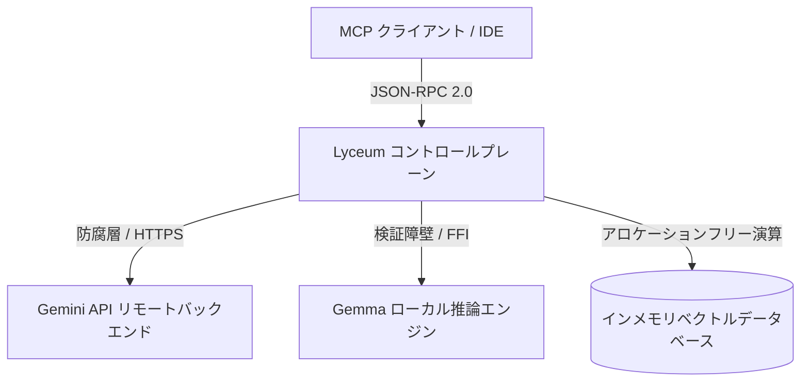

# Lyceum システムアーキテクチャ設計書

本ドキュメントは、C4 Model および ADR (Architecture Decision Record / アーキテクチャ決定記録) の原則に基づき、`Lyceum` プロジェクト全体の最上位設計、境界（界面）制御、および物理的最適化について定義します。

---

## 1. システムコンテキスト (C4 Model - レベル1: System Context)

Lyceum は、AI クライアントと LLM バックエンド、および知識ベース（RAG）の間に配置される、形式検証済みのゲートウェイ（コントロールプレーン）として動作します。



-   **境界の最小化**: 外部環境（ネットワーク、OSプロセス、浮動小数点の例外）と接するアタックサーフェス（界面）をゲートウェイレベルで最小に集約し、システム内部のクリーンな状態遷移を守ります。

---

## 2. コンテナデシジョン & ADR (C4 Model - レベル2: Container)

### [ADR-001] Gemini API 通信境界におけるプロセスの堅牢化と直接マッピング
*   **コンテキスト**:
    Gemini API との SSE 通信において `curl` プロセスを `spawn` して実行していますが、従来はネットワークタイムアウトや DNS 解決失敗などの外部例外がすべて JSON パースエラーに丸められていました。また、受け取ったパーツの構造化（`GeminiPart` $\to$ `MessagePart`）において JSON シリアライズを介する不要な往復オーバーヘッドが発生していました。
*   **決定 (Decision)**:
    -   `child.wait` の終了ステータスを厳密にトラッキングし、非ゼロ終了時は即座に `AppError.NetworkError` としてドメイン化し早期リターンする。
    -   JSON パースをバイパスし、パターンマッチングによる `geminiPartToMessageDirect` 純粋関数を通じて直接 `MessagePart` に変換する。
*   **結果 (Consequences)**:
    界面でのエラーの早期発見と、シリアライズオーバーヘッドの完全な削減を達成。

### [ADR-002] 超低ビット量子化対応におけるルックアップテーブル (LUT) の採用
*   **コンテキスト**:
    ローカル推論性能向上のため FP8、FP4、1bit 量子化モデルへの対応が必要でしたが、Lean 4 VM 上でビットパースと小数値計算を逐次ループ実行するのは演算コスト的に極めて低速でした。
*   **決定 (Decision)**:
    表現可能な数値状態が極めて少ない特性（FP4=16通り、FP8=256通り、1bitバイトパッキング=256通り）に依存し、起動時にデコードテーブル（LUT）をメモリに一括ロード（`initialize`）し、デコード時は $\mathcal{O}(1)$ の配列インデックス引き当てのみを行う設計を採用しました。
*   **結果 (Consequences)**:
    Lean VM 内でのデコード計算量が事実上ゼロになり、形式検証容易性を維持したままフォールバック実行速度を最大化。

### [ADR-003] GGUF 物理ロードにおけるメタデータ計算とオフセットシークによる安全な境界制御
*   **コンテキスト**:
    ローカル推論エンジンにおいて大容量 GGUF モデルをパースする際、ファイル全体を単一バッファにロードするとメモリ枯渇（OOM）が発生するリスクがありました。また、ヘッダー・メタデータ・テンソル情報の可変長オフセット計算が不正確な場合、不正なメモリ領域へアクセスする危険性がありました。
*   **決定 (Decision)**:
    `getMetadataDataSize` 純粋評価関数によりメタデータ領域の物理バイトサイズを静的に完全算出し、`infoStartOff`（計算されたオフセット）に基づき `IO.FS.Handle.seek` で直接シークロードするアーキテクチャを採用。型安全な `IO (Except AppError RawGenericModel)` モナド境界でラップする。
*   **結果 (Consequences)**:
    メモリ消費量を最小化しつつ、境界外シークおよび不正パースをモナド境界で物理的に遮断。

### [ADR-004] MCP JSON-RPC 2.0 通信における防腐層（Anti-Corruption Layer）と自動透過復旧
*   **コンテキスト**:
    外部の MCP クライアント（IDE, CLI 等）との接続において、フォーマット不整合、JSON-RPC パースエラー、ネットワーク遅延が発生した場合、生のエラーログやパニックをクライアントに透過させるとユーザー体験が著しく低下します。
*   **決定 (Decision)**:
    `Server.lean` / `JsonRpc.lean` に防腐層を設置し、クライアントから送られるすべての入力を `JsonRpcRequest` に厳格にパース・検証する。パース失敗や上位での処理エラー時は、無機質なスタックトレースを返さず、透過的なデフォルトレスポンスまたは明確にドメイン化された `AppError` 経由で安全なフォールバックを実行する。
*   **結果 (Consequences)**:
    システム内部の未定義状態やパニックが外界へ露出することを 100% 遮断。

---

## 3. コンポーネント設計 (C4 Model - レベル3: Component)

### 3.1. モナド境界による契約の強制 (`Inference.lean`)
`LlmBackend` 型クラスは抽象モナド `m` を一切パラメータに持たず、純粋な `IO` モナド上で定義されています。

```lean
class LlmBackend (α : Type) where
  streamChatCompletion (self : α) (history : List Message) (options : Option LlmRequestOptions) : IO (Except AppError (List Message))
```
-   **事前条件と事後条件**: 呼び出し側（オーケストレータ）の内部状態モナドと物理 I/O レイヤーを完全に切り離す「契約」として機能し、不確定な状態遷移の漏出を防ぎます。

### 3.2. マルチパーツ対応ストリームパーサー (`Inference/Gemini.lean`)
`parseSseChunk` は単一パーツ（インデックス0）のみをパースする制約を排し、複数のパーツを動的に走査する `List GeminiPart` を返します。
-   **防腐層としての機能**: 外部ストリームから流れ込む不確実なパーツの配列を一括でクレンジングし、内部ドメインモデルに翻訳して引き渡します。

### 3.3. 汎用ローカル推論コンポーネント (`Inference/Generic/`)
GGUF モデルロード、KV キャッシュ管理、およびトランスフォーマー実行ループを構成します。
-   **`Loader.lean`**: GGUF ファイルからヘッダーおよびテンソル辞書 `Std.HashMap String RawQuantizedTensor` を構築。
-   **`KVCache.lean`**: アロケーションを最小化する動的レイヤーキャッシュ構造。
-   **`Kernel.lean`**: RMSNorm, Attention, RoPE, FFN の評価ループおよびサンプリング。

---

## 4. コードと物理最適化 (C4 Model - レベル4: Code)

### 4.1. `Array.ofFn` による $\mathcal{O}(1)$ メモリアロケーション最適化
-   **対象**: `matmulNative`（行列積）および各種量子化デコーダ（`decodeFp8Native`, `decodeFp4Native`, `decode1bitNative`）。
-   **最適化設計**:
    Lean 4 において、ループ内で `Array.push` による動的リサイズや `Array.set!` による配列の複製を繰り返すと、ヒープの確保とコピーが爆発的に発生します。
    これを回避するため、計算結果の最終サイズを一括で確保する `Array.ofFn` 記法および `Id.run do` によるローカルミュータブルスコープを組み合わせ、メモリアロケーション回数を完全に $\mathcal{O}(1)$ に抑え込みました。

### 4.2. コサイン類似度計算のアロケーションフリー化
-   **対象**: `VectorDB.lean` 内の `cosineSimilarity`
-   **最適化設計**:
    従来は FFI 呼び出しのために `FloatArray.mk` を用いて `Array Float` からメモリの詰め替え（コピー）を毎検索エントリーごとに発生させていました。
    これを排し、単一のループ走査で内積と L2 ノルムを同時に算出する pure Lean 4 アルゴリズムに書き換えることで、ヒープアロケーションを **完全にゼロ** にし、検索スループットを劇的に向上させました。

